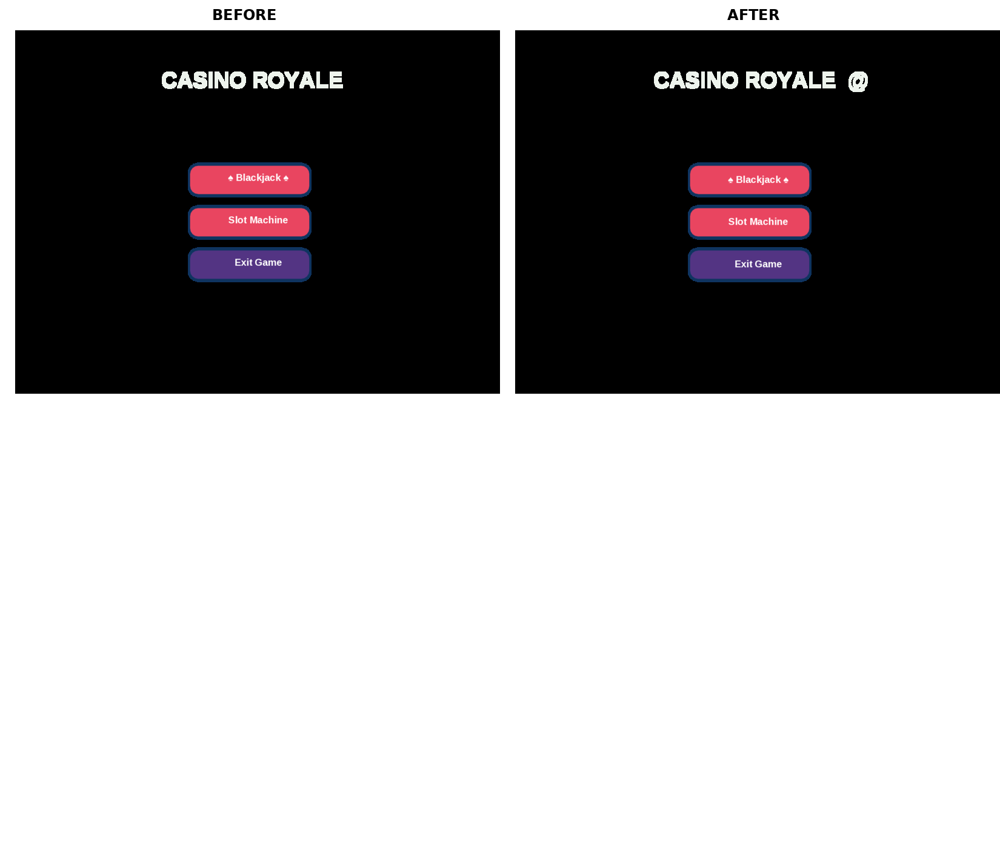

# Button Text Alignment Fix

## Problem
The text in all buttons was not properly vertically aligned within the button rectangles. The text appeared too low, making the buttons look unbalanced.

## Root Cause
The button text positioning used incorrect y-coordinate calculations that placed text below the vertical center of buttons:

1. **Main Menu Buttons** (`main.py`): Used `y - height/2 - 5` instead of proper centering
2. **Blackjack Start Button** (`blackjack.py`): Text at y=-243 instead of y=-238 (for button starting at y=-250 with height 40)
3. **Blackjack Draw Card Button** (`blackjack.py`): Text at y=-243 instead of y=-238
4. **Blackjack Reveal Dealer Button** (`blackjack.py`): Text at y=223 instead of y=232 (for button starting at y=250 with height 40)

## Changes Made

### File: `main.py`
**Line 46** - Main menu button text positioning:
```python
# Before:
btn.goto(x + width/2, y - height/2 - 5)

# After:
btn.goto(x + width/2, y - height/2 - 8)
```
- Changed y-offset from -5 to -8 pixels to better center text vertically
- Affects all three main menu buttons: Blackjack, Slot Machine, and Exit Game

### File: `blackjack.py`
**Line 84** - Start button text positioning:
```python
# Before:
start_button.goto(0, -243)

# After:
start_button.goto(0, -238)
```
- Moved text up by 5 pixels for better vertical centering

**Line 110** - Draw Card button text positioning:
```python
# Before:
draw_card_button.goto(170, -243)

# After:
draw_card_button.goto(170, -238)
```
- Moved text up by 5 pixels for better vertical centering

**Line 135** - Reveal Dealer button text positioning:
```python
# Before:
reveal_dealer_button.goto(0, 223)

# After:
reveal_dealer_button.goto(0, 232)
```
- Moved text up by 9 pixels for better vertical centering

## Visual Comparison

### Main Menu - Before and After


The three main menu buttons now have properly centered text that aligns with the visual center of each button rectangle. You can see in the comparison:
- **Before**: Text appears too low in all buttons
- **After**: Text is properly centered vertically

### Blackjack Screen - After Fix


All three buttons (Start, Draw Card, and Reveal Dealer) now have properly centered text within their button boundaries.

## Impact
- **Visual Improvement**: Buttons now appear more balanced and professional
- **Consistency**: All buttons across the application now have consistent text alignment
- **No Functional Changes**: Only visual positioning was modified; all button click handlers remain unchanged
- **Files Modified**: 2 files (main.py, blackjack.py)
- **Lines Changed**: 4 lines total

## Testing
Screenshots were taken before and after the fix to verify proper text alignment in buttons.

## Screenshots Available
- `screenshots_before_main.png` - Main menu before fix
- `screenshots_after_main.png` - Main menu after fix
- `screenshots_after_blackjack.png` - Blackjack screen after fix
- `comparison_main_menu.png` - Side-by-side comparison of main menu
- `comparison_blackjack.png` - Blackjack screen showcase

