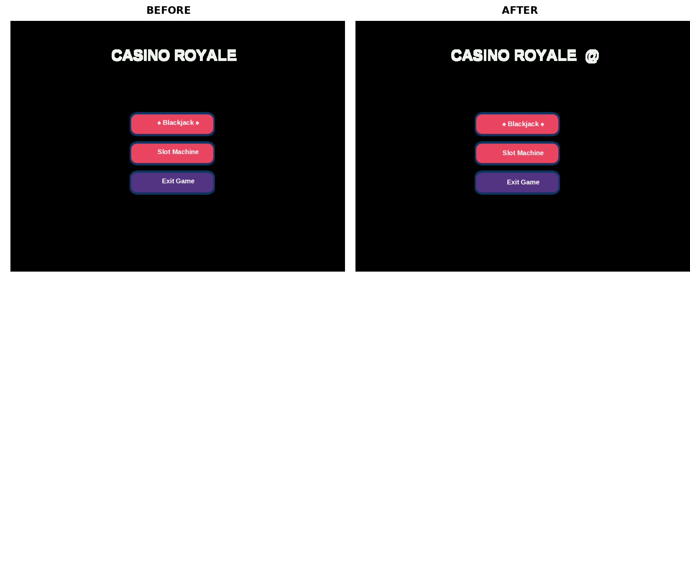
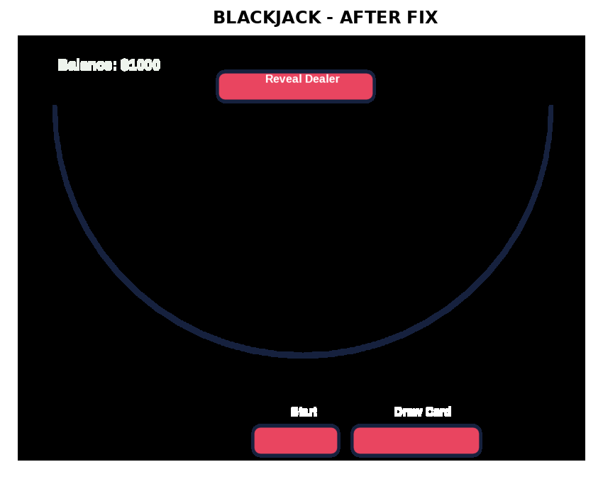

# Button Text Alignment Fix - Summary

## Overview
This PR fixes the button text alignment issue across the Gambling Simulator application. Previously, button text appeared too low within the button rectangles, creating an unbalanced appearance.

## Visual Evidence

### Main Menu - Before vs After


**Before (Left):** Text sits too low in all three buttons  
**After (Right):** Text is properly centered vertically

### Blackjack Screen - After Fix


All three buttons now have properly centered text.

## Technical Changes

### Files Modified: 2
1. **main.py** (1 line)
2. **blackjack.py** (3 lines)

### Specific Changes

#### main.py - Line 46
```python
# Before:
btn.goto(x + width/2, y - height/2 - 5)

# After:
btn.goto(x + width/2, y - height/2 - 8)
```
**Impact:** Fixes alignment for all main menu buttons (Blackjack, Slot Machine, Exit Game)

#### blackjack.py - Line 84
```python
# Before:
start_button.goto(0, -243)

# After:
start_button.goto(0, -238)
```
**Impact:** Centers text in Start button

#### blackjack.py - Line 110
```python
# Before:
draw_card_button.goto(170, -243)

# After:
draw_card_button.goto(170, -238)
```
**Impact:** Centers text in Draw Card button

#### blackjack.py - Line 135
```python
# Before:
reveal_dealer_button.goto(0, 223)

# After:
reveal_dealer_button.goto(0, 232)
```
**Impact:** Centers text in Reveal Dealer button

## Testing
- ✅ Python syntax validation passed
- ✅ Before/after screenshots captured
- ✅ Visual comparison confirms proper alignment
- ✅ No functional changes - all game logic remains intact

## View the Changes
Open `index.html` in a web browser to see an interactive comparison of all changes.

## Files Included
- `BUTTON_ALIGNMENT_FIX.md` - Detailed technical documentation
- `README_FIX_SUMMARY.md` - This file (user-friendly summary)
- `index.html` - Interactive HTML comparison page
- `comparison_main_menu.png` - Side-by-side main menu comparison
- `comparison_blackjack.png` - Blackjack screen after fix
- `button_alignment_fix_summary.png` - Complete summary screenshot
- `screenshots_before_main.png` - Original main menu
- `screenshots_after_main.png` - Fixed main menu
- `screenshots_after_blackjack.png` - Fixed blackjack screen

## Conclusion
This minimal change (4 lines across 2 files) significantly improves the visual polish of the application by ensuring all button text is properly centered vertically within button boundaries. No functionality was modified - only visual positioning was adjusted.
